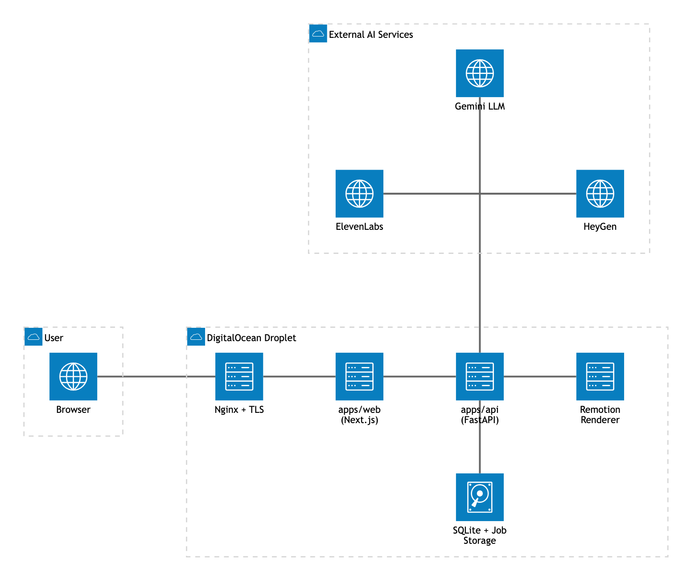

# OpenMontage Web — C-roll 数字人视频模块技术文档

> 文档范围说明：`OpenMontage Web` 这个仓库里还有账号系统、脑暴三件套、社区分享等模块，
> 本文档只覆盖**我负责的部分**——C-roll 数字人视频生成 pipeline、视频剪辑 Dashboard
> 前端、声音克隆、以及 DigitalOcean 部署这几块，其余模块不在范围内。
>
> 仓库：`github.com/UXxxx7/Web_ver_Edit`　整理日期：2026-08-20

---

## 目录

1. [项目概览](#1-项目概览)
2. [系统架构](#2-系统架构)
3. [核心业务流程 — C-roll Job 状态机](#3-核心业务流程--c-roll-job-状态机)
4. [代码结构说明](#4-代码结构说明)
5. [API 接口文档](#5-api-接口文档)
6. [部署流程](#6-部署流程)
7. [排障记录 / 踩过的坑](#7-排障记录--踩过的坑)
8. [环境变量清单](#8-环境变量清单)

---

## 1. 项目概览

OpenMontage Web 是 OpenMontage 品牌从 WhatsApp 机器人迁移出来的独立产品网站
（原产品是纯 WhatsApp 对话式视频剪辑工具）。新网站保留了原来的核心生成能力，改成
浏览器端的 Dashboard + Agent 对话式交互。

我负责的这部分，产品形态可以概括成一句话：

> **上传一张照片 + 一段口播提示（可选一段声音样本） → AI 自动写文案 → 生成
> "数字人开口讲话"的短视频 → 套用图文并茂的视觉模板 → 用户确认后导出成片。**

对应到代码里就是 **C-roll pipeline**（`apps/api/app/heygen_croll.py` +
`content_planner.py` + `pipeline_runner.py`）和它在前端的入口 ——
`/agent` 对话式 Dashboard（`apps/web/components/AgentChat.tsx` /
`FeatureHub.tsx` / `Dashboard.tsx`）。

---

## 2. 系统架构



三层结构，一台 DigitalOcean Droplet 上用 Docker Compose 跑三个容器：

| 层 | 组件 | 职责 |
|---|---|---|
| 接入层 | Nginx | TLS 终止 + 反向代理；默认把所有请求转给 `web`，**只有 `/files/*` 直接转给 `api`**（原因见第 7 节） |
| 应用层 | `apps/web`（Next.js） | 页面、鉴权、Server Actions；不直接触碰生成逻辑，全部转发给 `apps/api` |
| 应用层 | `apps/api`（FastAPI） | 生成逻辑的唯一实现：C-roll 文案、声音克隆、调 HeyGen、跑剪辑管线、维护 Job 状态机 |
| 渲染层 | Remotion（headless Chrome，`npx remotion render`） | 把 `apps/api` 规划好的 props 渲染成真正的视频画面（图文卡片、字幕、进度条等视觉模板） |
| 数据层 | SQLite + 本地文件存储 | Job/User/Message 记录用 SQLite；上传素材、中间产物、成片用普通文件系统，按 `job_id` 分目录 |
| 外部服务 | Gemini（LLM）、ElevenLabs（声音克隆/转写）、HeyGen（数字人视频生成） | 纯 HTTP 调用，任何一个没配 key 都会"优雅降级"而不是整体报错（比如没有 HeyGen key 就不能生成数字人视频，但脑暴工具仍然可用） |

**内容规划的 Arm A / Arm B 双臂设计**（`content_planner.py` /
`pipeline_runner.py`）：apply_style 这一步不是简单套模板，而是先用 LLM
分析口播文案该分几个章节、哪些数字该做成数据卡/仪表盘/倒计时/日历，再喂给
Remotion 渲染。Arm A 是本地确定性兜底逻辑，Arm B 是更强的 LLM 编排版本，
用 `ARM_B_ENABLED` / `ARM_B_PERCENT` 做灰度切换，Arm B 拿不到结果时会自动
落回 Arm A，不会让整条流水线因为一次 LLM 调用失败而中断。

---

## 3. 核心业务流程 — C-roll Job 状态机

一次完整的 C-roll 生成，Job 会依次经过这些状态（`app/database.py` 的
`JobStatus` 枚举）：

```
DOWNLOADING_MEDIA
     │  (heygen_croll: 上传照片 -> 生成数字人视频，作为后续管线的"输入视频")
     ▼
PLANNING
     │  (content_planner: 转写 + 规划剪辑方案)
     ▼
WAITING_CONFIRMATION  ── 用户/Agent 确认方案 ──▶  RUNNING_PIPELINE
                                                       │
                                    (keep_range → remove_filler → apply_style)
                                                       ▼
                                                 PREVIEW_READY
                                                       │
                              ┌────────────────────────┼────────────────────────┐
                          点"修改"/revise         打开手动编辑器           点"储存最终影片"
                          回到 WAITING_CONFIRMATION   (editor 系列接口)         │
                                                                                 ▼
                                                                             RENDERING
                                                                                 │
                                                                                 ▼
                                                                               DONE
```

任何一步出错 → `ERROR`（`error_message` 字段记录原因，前端据此展示"重试"）。

**关键设计：apply_style 允许"降级交付"而不是整单失败。** 每次渲染完会先抽
关键帧做视觉复审（`qa_stills.py`：intro 落位、每张数据卡展开后、卡片满屏中点、
片尾），发现明显问题（比如字体缺字变乱码方块）会自动重新规划、重渲一次；
仍不过关就放弃这一步、把上一步（没套用视觉模板但内容是对的）的结果交付给
用户，并在 UI 上明确提示"有几步未完全做到：apply_style"——保证用户永远拿到
一个能看的视频，而不是卡在中间。

具体步骤拆解：

1. **`/croll`**（`webhook.py`）收到照片 + 提示文字 + 可选声音克隆 → 后台线程：
   - `croll_script.py`：AI 看图 + 提示 → 写一段口播文案
   - `voice_clone.py`（如果这个用户克隆过声音）：把文案合成成克隆音色的语音
   - `heygen_croll.py`：上传照片拿 `talking_photo_id` → 提交生成（文案/克隆语音
     二选一）→ 轮询拿到数字人说话的视频
2. 拿到视频后，Job 无缝切入**普通视频剪辑管线**——`confirm` / `retry` /
   `render` 这些接口后面就跟"用户直接上传视频剪辑"完全共用一套代码，C-roll
   只是"如何拿到第一条视频"的差异。
3. `pipeline_runner.py` 依次跑三个操作（op）：
   - `keep_range`：按方案截取有效片段
   - `remove_filler`：去掉口误/填充词（对照 C-roll 原始文案纠正转写文本）
   - `apply_style`：`content_planner.py` 做内容规划 → `remotion_bundle.py`
     打包 Remotion 项目 → `npx remotion render` 真正渲染出带图文卡片/字幕/
     进度条的成片 → `qa_stills.py` 视觉复审（不过关重试一次，再不过关就降级）
4. `PREVIEW_READY` 后用户可以：点"储存最终影片"（`POST /jobs/{id}/render`
   触发最终导出）、点"修改"带反馈重新规划（`POST /jobs/{id}/revise`）、或
   打开手动编辑器精细调整（`editor/*` 系列接口，卡片位置/时间轴级别的覆盖）。

---

## 4. 代码结构说明

### 4.1 `apps/web`（Next.js 16 · App Router · TS · Tailwind v4）

```
apps/web/
├─ app/(app)/            登录后的主体页面
│  ├─ agent/             对话式 Dashboard —— C-roll / 视频剪辑 / 声音克隆的统一入口
│  ├─ videos/            账号级"我的影片"
│  ├─ editor/            手动编辑器（时间轴/卡片覆盖）
│  ├─ community/         站内成片分享 feed
│  └─ profile/           用户资料（行业/品牌调性，影响 AI 生成口吻）
├─ app/(auth)/           登录/注册（mock 模式或真实 Supabase 二选一）
├─ components/
│  ├─ AgentChat.tsx      核心交互组件：识别附件类型（视频/单张照片/单段音频），
│  │                     分发到剪辑 / C-roll / 声音克隆三条路径
│  ├─ Dashboard.tsx / FeatureHub.tsx   首页功能入口卡片
│  ├─ OnboardingChecklist.tsx          新用户引导（含"试一下声音克隆"）
│  ├─ MyVideos.tsx / EditorPicker.tsx  历史成片 & 送入编辑器
│  └─ ResultCard.tsx / VideoPlayer.tsx 生成结果展示（对应截图里那张预览卡）
└─ lib/
   ├─ auth.ts / session.ts   鉴权 + session cookie（HMAC 签名，见部署踩坑）
   └─ store.ts / data.ts     Supabase 未配置时的本地 mock 存储
```

前端**不直接实现任何生成逻辑**——所有 Server Action 最终都是转发 HTTP 请求
到 `apps/api`（`API_BASE_URL`，容器间用 Docker 内部 DNS `http://api:8001`）。

### 4.2 `apps/api`（FastAPI）

核心模块职责表：

| 模块 | 职责 |
|---|---|
| `webhook.py` | 所有 HTTP 路由入口（详见第 5 节），~1400 行 |
| `worker.py` | 后台任务调度：`/croll`、`/jobs` 等接口"立即返回 + 后台线程跑生成"的实现 |
| `job_manager.py` / `database.py` | Job/User/Message 的 SQLAlchemy 模型 + 状态机 CRUD |
| `heygen_croll.py` | 薄封装：照片 → HeyGen talking photo → 提交生成 → 轮询下载，失败只返回 `None`，不抛异常 |
| `voice_clone.py` | ElevenLabs Instant Voice Clone：一段样本建声音、之后每次生成都优先用克隆音色 |
| `content_planner.py` | 转写文案的"内容判断"：分几章、哪些数字该做数据卡/仪表盘/倒计时/日历（~3700 行，这是 apply_style 效果好不好的核心） |
| `pipeline_runner.py` | 剪辑管线编排：keep_range / remove_filler / apply_style 等 op 的执行、重试、降级逻辑（~4000 行） |
| `remotion_bundle.py` | 把 `remotion-composer/` 打包成可渲染的 bundle，源码变了才重新打包 |
| `qa_stills.py` | 渲染前后的机器可查视觉复审（抽帧 + 规则检查） |
| `props_lint.py` | apply_style 输出的 props 结构校验（比如"卡片缩小了但没内容"这类布局 bug） |
| `agent_editor.py` | L2 Agent 原型：工具调用循环 + Human Checkpoint，独立脚本，不接生产路径 |
| `editor_token.py` | 给手动编辑器签发短期访问 token |

### 4.3 `apps/api/remotion-composer`（Remotion 项目，真正画面的来源）

```
remotion-composer/src/
├─ XiaojinEditorial.tsx     C-roll 数字人视频的主视觉模板（竖屏 9:16、悬浮卡片、
│                           持续可见的 ChapterNav、卡拉OK 字幕、合规声明条、
│                           彩虹进度条）——今天修的字体 bug 就在这个文件
├─ components/xiaojin/*.tsx 该模板下的所有图形组件（数据卡/仪表盘/倒计时/
│                           对比卡/引用卡/二维码卡……）
└─ components/charts/*.tsx  通用图表组件（柱状图/折线图/饼图）
```

字体加载在 `XiaojinEditorial.tsx` 里用 `@remotion/google-fonts`，`loadFont()`
内部自带 `delayRender`/`continueRender`，会正确阻塞渲染直到字体就绪——今天
排查到的问题不是异步竞态，而是选错了字体**字集**（详见第 7 节）。

---

## 5. API 接口文档

Base URL：容器内 `http://api:8001`，对外只有 `/files/*` 直接暴露
（见第 6 节 nginx 配置）。

| Method | Path | 用途 |
|---|---|---|
| `POST` | `/croll` | 照片 + 提示文字 → 后台生成 C-roll（数字人说话视频）。立即返回 `job_id`，轮询 `GET /jobs/{id}` |
| `POST` | `/social-batch` | 一张照片 → 一批多平台社媒变体（IG Feed/Reel、TikTok、Story），共享一个 `batch_id` |
| `POST` | `/voice-clone` | 上传一段语音样本，同步建好 ElevenLabs 声音克隆，`voice_id` 存到该用户账号上 |
| `POST` | `/jobs` | 上传视频 + 剪辑需求 → 创建普通视频剪辑 Job |
| `GET`  | `/jobs/{job_id}` | 查询 Job 当前状态、预览/成片路径、降级/质量提示等全部字段 |
| `POST` | `/jobs/{job_id}/confirm` | 用户确认剪辑方案 → 进入 `RUNNING_PIPELINE` |
| `POST` | `/jobs/{job_id}/retry` | 按原方案整单重跑（不改方案，用于"预览里有降级步骤，想要完整效果"或整单报错后重试） |
| `POST` | `/jobs/{job_id}/revise` | 就地修订：带用户反馈重新规划方案（方案阶段/预览阶段都可用） |
| `POST` | `/jobs/{job_id}/render` | 触发最终导出（"储存最终影片"按钮），完成后进入 `DONE` |
| `GET`  | `/users/{wa_number}/onboarding-status` | 首页 onboarding checklist 用：历史生成次数 + 是否已做过声音克隆 |
| `GET`  | `/users/{wa_number}/videos` | 账号级"我的影片"列表（按 `DONE` 状态、新到旧） |
| `GET/POST` | `/editor/{job_id}/*` | 手动编辑器系列接口：读写 props、时间轴覆盖、重排版、缩略图/波形 |
| `POST` | `/jobs/{job_id}/editor_token` | 签发手动编辑器的短期访问 token |
| `GET`  | `/files/{job_id}/{filename}` | 公网文件服务：成片下载、以及**外部服务**（HeyGen）抓取生成的音频文件 |
| `GET`  | `/jobs-health` / `/workers/health` | 健康检查 |

> `wa_number` 参数名是历史遗留（WhatsApp 时代的用户标识），网页版这里传的
> 是 `apps/web` 那边的 `user.id`，两边约定一致，不是真的手机号。

---

## 6. 部署流程

### 6.1 基础设施

- **DigitalOcean Droplet**，单机部署，Docker Compose 编排三个服务：`nginx` /
  `web` / `api`（`docker-compose.yml`，仓库根目录）。
- **域名**：没有购买自定义域名，用 `<Droplet IP 反写>.nip.io`（一个解析回
  自身 IP 的公共通配符域名）当证书域名——Let's Encrypt 的 HTTP-01 challenge
  照常能验证，省了购买域名的步骤，小规模部署够用。
- **HTTPS 是硬要求，不是可选项**：`apps/web` 的 `lib/auth.ts` 设置 cookie
  时带 `secure: NODE_ENV === "production"`，纯 HTTP 下浏览器会静默丢弃
  session cookie——登录接口显示 200，但下一个请求就又是"未登录"，所有页面
  循环跳转回 `/login`。

### 6.2 部署步骤（从零开始）

```bash
# 1. 代码同步到 Droplet（服务器上不是 git 仓库，是直接同步文件——
#    没有在服务器上装 git 工作流，更新靠 scp/rsync 覆盖 + 重新 build）
scp -r . root@<droplet-ip>:/opt/openmontage-web

# 2. 配置各服务 .env（.env.example 是模板，见第 8 节）
#    apps/api/.env  —— LLM/ElevenLabs/HeyGen key、PUBLIC_BASE_URL 等
#    根目录 .env    —— SESSION_SECRET 等 compose 用到的变量

# 3. 起服务
cd /opt/openmontage-web
docker compose up --build -d

# 4. 签发证书（nginx 容器已经把 /.well-known/acme-challenge 挂到宿主机）
certbot certonly --webroot -w /var/www/certbot -d <ip>.nip.io
# 证书目录已经在 docker-compose.yml 里以只读方式挂进 nginx 容器
# (/etc/letsencrypt:/etc/letsencrypt:ro)，certbot renew 后 reload 一下 nginx 即可
```

### 6.3 三个具名 volume（`docker-compose.yml`）—— 都是真实事故后补的

| Volume | 挂载点 | 为什么必须持久化 |
|---|---|---|
| `api_storage` | `api:/app/storage` | 每个 Job 的素材/中间产物/成片，没这个每次 `--build` 就把所有人生成过的视频全清空 |
| `api_db` | `api:/app/db` | SQLite 数据库文件；连着上面那条，"我的影片"功能才有意义 |
| `web_data` | `web:/app/.data` | mock 模式的账号数据库（`lib/store.ts`）；没这个每次重建都把所有注册账号清空，但 session cookie 的 HMAC key（`SESSION_SECRET`）不受影响，于是出现过"登录态还在、但账号已经不存在"的死循环重定向 |

### 6.4 更新代码 / 热修复流程

- 正常改动：本地改完 → `scp`/`docker cp` 覆盖对应文件 → 视改动范围决定
  `docker compose up --build -d`（改了依赖/Dockerfile）还是只重启容器。
- Remotion 相关的改动（`remotion-composer/src/*`）**不需要重启容器**——
  `remotion_bundle.py` 每次渲染前会检测源码是否变化，变了就自动重新
  `npx remotion bundle`，`docker cp` 完文件后下一次渲染就会用上新代码，
  可以直接拿一个真实 Job 验证效果。

---

## 7. 排障记录 / 踩过的坑

这几个是最近实际排查过、有真实代价（要么用户看到坏结果，要么直接烧了
HeyGen/LLM 调用额度）的问题，记下来避免以后重复踩：

1. **HeyGen 拿不到生成的语音文件，实际在下载登录页**
   `/files/*` 之前和其他所有请求一样先经过 `apps/web`，而 HeyGen 是外部服务
   直接抓取这个 URL、没有登录态，被 `proxy.ts` 的鉴权 307 到 `/login`，
   HeyGen 报错 "Non-media HTTP 200 response ... text/html"——它下载到的是
   登录重定向页，不是音频。**修复**：nginx 里单独给 `/files/` 一条
   直连 `api:8001` 的路由，绕开 `apps/web` 的登录门（`job_id`/`filename`
   本身是不可猜测的 UUID，安全边界和 `apps/web` 自己的文件服务一致）。

2. **apply_style 反复降级，字幕/标题变成方块乱码**
   `qa_stills.py` 连续 3 轮视觉复审都报"字符缺失显示为方框"。根因是
   `XiaojinEditorial.tsx` 用的是 `NotoSansTC`（繁体中文，`chinese-traditional`
   字集），但 `content_planner.py` 产出的文案是简体中文——繁体字集不覆盖
   简体专属码点（比如"买/说" vs "買/說"是不同的 Unicode 码点）。**修复**：
   换成 `NotoSansSC` / `chinese-simplified`。（曾怀疑是 `loadFont()` 没等
   加载完就渲染的竞态问题，排查后确认 `@remotion/google-fonts` 内部已经
   用 `delayRender`/`continueRender` 处理好了，不是这个原因。）

3. **HeyGen "视频生成超时或失败"，其实是账户没余额**
   报错信息很泛，日志里挖到真实原因是 HeyGen 返回
   `MOVIO_PAYMENT_INSUFFICIENT_CREDIT`——账户 API 额度用完了，不是代码问题。
   充值后同一个 Job 重试立刻就成功。

4. **声音克隆样本上传，格式被错误识别成 .mp3**
   不管用户实际录的是什么格式，都硬编码按 `.mp3`/`audio/mpeg` 处理，
   ElevenLabs 校验实际音频内容和声明的格式对不上直接 400。改成用
   `mimetypes.guess_type` 猜真实类型再声明。

5. **登录态死循环**：见上面 6.3 里 `web_data` volume 那条——本质是"重建
   清空了账号数据，但 session cookie 签名还有效"这个组合导致的。

---

## 8. 环境变量清单（我们这部分用到的）

完整模板见 `apps/api/.env.example`，这里只列 C-roll / 声音克隆 / 部署
直接相关的几个：

| 变量 | 作用 | 缺失时的行为 |
|---|---|---|
| `HEYGEN_API_KEY` | 数字人视频生成（`/croll`） | 功能不可用 |
| `ELEVENLABS_API_KEY` | 声音克隆 + 转写 | 声音克隆硬失败；转写自动退回本地 faster-whisper |
| `LLM_API_KEY` / `LLM_BASE_URL` / `LLM_MODEL` | `content_planner.py` 的内容规划、`croll_script.py` 的文案生成 | 规划退回 Arm A 本地确定性兜底，文案生成失败 |
| `PUBLIC_BASE_URL` | 拼出 `/files/...` 的公网 URL，喂给 HeyGen 抓取音频、编辑器分享链接 | **部署到新环境必须改**，忘改会导致 HeyGen 抓不到音频（域名不对） |
| `EDITOR_TOKEN_SECRET` | 手动编辑器分享链接签名 | 打开编辑器直接报错 |
| `REMOTION_CONCURRENCY` | apply_style 渲染的并发线程数 | 默认 1；小内存 Droplet 上不建议调高，Remotion 自己猜的并发数在容器里可能猜多了（按宿主机核数而非容器配额） |
| `SESSION_SECRET`（根目录 `.env`） | `apps/web` session cookie 的 HMAC key | 不设的话每次重启都用不同的临时值，等于强制所有人重新登录 |
